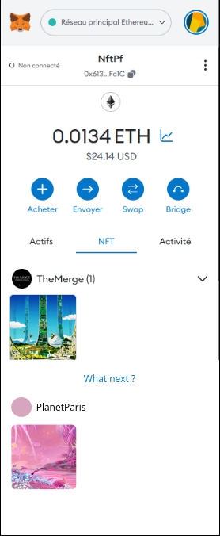

# Very Smart Contract

This project aims to provide a platform able to find NFTs collections that a user might be interested in, based on NFTs characteristics, and a model trained on creators-provided data.

## Repository structure

- [**backend**](backend) holds the API responsible for getting data from NFTs marketplaces
- [**frontend**](frontend) is the webapp accessed by all users
- [**smart-contracts**](smart-contracts) contains the Solidity contracts needed by the platform

### Backend

_WIP_

### Frontend

#### 1. Go to `/frontend`

    cd frontend

#### 2. Install dependencies

    npm install

#### 3. Run the app

    npm run start

### Smart Contracts

### 1. Go to `/smart-contracts`

    cd smart-contracts

### 2. Add your secret identifiers

1. Copy the `.env.example` file to a `.env` file
2. Fill it with your Infura identifiers for chain access
3. If you want to use Truffle the old way, add you mnemonic
4. If you want to verify your instance of the contract on Etherscan, also add your Etherscan API key

### 3. Install dependencies

    npm install

### 4. Deploy the contract

    npm run deploy:sepolia

## UI example

